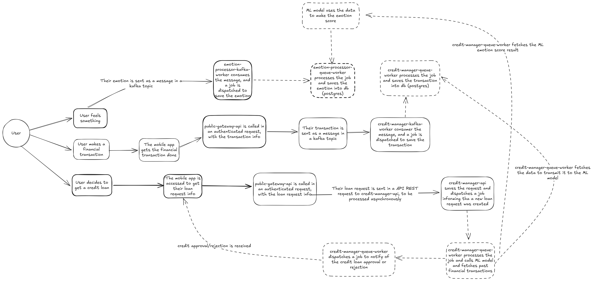

# Coding Challenge Solution

Here is my solution to the proposed coding challenge.

## Use cases and data flow


## Assumptions made
- You have `docker` installed in your system
- Port 8883 is available

## How to start the project in your machine
You need to have `docker` installed and accessible by your terminal. With it, you can run the following command in the root folder to start the project:
- `docker compose -f docker-compose.dev.yaml up -d`

After the command runs successfuly, you need to execute three more commands:
- `docker exec cldwlk-test-credit-manager-api alembic upgrade head`
- `docker exec cldwlk-test-emotion-processor-api alembic upgrade head`
- `docker exec cldwlk-test-public-gateway-api alembic upgrade head`

## Available API REST endpoints
- `/internal/tests/create-user [POST]`
  - Description: creates user to validate the test locally
  - Curl:
```
curl --request POST \
  --url http://localhost:8883/internal/tests/create-user \
  --header 'Content-Type: application/json' \
  --data '{
	"email": "example@example.com",
	"password": "abc123"
}'
```
  - Example response:
```
{
	"guid": "b50bd88a-84b9-4d42-9f71-116f4e2561d9",
	"email": "example@example.com",
	"api_key": "03d9d94b-371e-4d92-8bbe-8af7a10a6a6e",
	"user_metadata": [
		{
			"guid": "be0af824-b197-4c2a-9882-e14e6809a6ee",
			"user_guid": "b50bd88a-84b9-4d42-9f71-116f4e2561d9",
			"key": "profile_guid",
			"value": "38912240-5e22-444b-bf10-65118583ef38"
		}
	],
	"registered_on": "2025-08-19T17:32:30.899669"
}
```
- `/internal/tests/get-user-data [POST]`
  - Description: get user data to be used at the authenticated requests
  - Curl:
```
curl --request POST \
  --url http://localhost:8883/internal/tests/get-user-data \
  --header 'Content-Type: application/json' \
  --data '{
	"email": "example@example.com",
	"password": "abc123"
}'
```
  - Example response:
```
{
	"guid": "b50bd88a-84b9-4d42-9f71-116f4e2561d9",
	"email": "example@example.com",
	"api_key": "03d9d94b-371e-4d92-8bbe-8af7a10a6a6e",
	"user_metadata": [
		{
			"guid": "be0af824-b197-4c2a-9882-e14e6809a6ee",
			"user_guid": "b50bd88a-84b9-4d42-9f71-116f4e2561d9",
			"key": "profile_guid",
			"value": "38912240-5e22-444b-bf10-65118583ef38"
		}
	],
	"registered_on": "2025-08-19T17:32:30.899669"
}
```
- `/emotion/new [POST]`
  - Description: create new emotion trace; request needs to be authenticated
  - Curl:
```
curl --request POST \
  --url http://localhost:8883/emotion/new \
  --header 'Authorization: Bearer API_KEY' \
  --header 'Content-Type: application/json' \
  --data '{
	"emotions": [
		{
			"name": "angry",
			"percent": 10
		},
		{
			"name": "disgusted",
			"percent": 80
		},
		{
			"name": "surprised",
			"percent": 10
		}
	]
}'
```
  - Example response:
```
{
	"emotions": [
		{
			"name": "angry",
			"percent": 10.0
		},
		{
			"name": "disgusted",
			"percent": 80.0
		},
		{
			"name": "surprised",
			"percent": 10.0
		}
	],
	"received_at": "2025-08-19T18:02:23.302570"
}
```

- `/emotion/list [GET]`
  - Description: get emotion traces; request needs to be authenticated
  - Curl:
```
curl --request GET \
  --url http://localhost:8883/emotion/list \
  --header 'Authorization: Bearer API_KEY'
```
  - Example response:
```
[
	{
		"emotions": [
			{
				"name": "angry",
				"percent": 10.0
			},
			{
				"name": "disgusted",
				"percent": 80.0
			},
			{
				"name": "surprised",
				"percent": 10.0
			}
		],
		"received_at": "2025-08-19T18:04:24.589882"
	}
]
```

- `/financial-transaction/new [POST]`
  - Description: create new financial transaction; request needs to be authenticated
  - Curl:
```
curl --request POST \
  --url http://localhost:8883/financial-transaction/new \
  --header 'Authorization: Bearer API_KEY' \
  --header 'Content-Type: application/json' \
  --data '{
	"source": "internal",
	"reason": "other",
	"is_paid": false,
	"paid_at": null,
	"due_at": "2025-12-31",
	"amount": "123.45"
}'
```
  - Example response:
```
{
	"source": "internal",
	"reason": "other",
	"amount": "123.45",
	"is_paid": false,
	"paid_at": null,
	"due_at": "2025-12-31T00:00:00"
}
```

- `/financial-transaction/list [GET]`
  - Description: get financial transaction data; request needs to be authenticated
  - Curl:
```
curl --request GET \
  --url http://localhost:8883/financial-transaction/list \
  --header 'Authorization: Bearer API_KEY'
```
  - Example response:
```
[
	{
		"source": "internal",
		"reason": "other",
		"amount": "123.45",
		"is_paid": false,
		"paid_at": null,
		"due_at": "2025-12-31T00:00:00"
	}
]
```

- `/credit-loan/new [POST]`
  - Description: create new credit loan request; request needs to be authenticated
  - Curl:
```
curl --request POST \
  --url http://localhost:8883/credit-loan/new \
  --header 'Authorization: Bearer API_KEY' \
  --header 'Content-Type: application/json' \
  --header 'User-Agent: insomnia/11.4.0' \
  --data '{
	"requested_amount": "123.45",
	"requested_credit_type": "short",
	"income": "1000",
	"reason": "personal",
	"webhook_url": "https://cldwlk-challenge-webhook-test.requestcatcher.com/"
}'
```
  - Example response:
```
{
	"guid": "e4a33be2-f1cc-408f-b238-a27e0efe5c26",
	"profile_guid": "38912240-5e22-444b-bf10-65118583ef38",
	"requested_amount": "123.45",
	"income": "1000.00",
	"requested_credit_type": "short",
	"reason": "personal",
	"status": "pending",
	"available_amount": null,
	"available_credit_type": null,
	"interest_rate": null,
	"webhook_url": "https://cldwlk-challenge-webhook-test.requestcatcher.com/"
}
```

- `/credit-loan/list [GET]`
  - Description: get credit loan requests data; request needs to be authenticated
  - Curl:
```
curl --request GET \
  --url http://localhost:8883/credit-loan/list \
  --header 'Authorization: Bearer API_KEY'
```

  - Example response:
```
[
	{
		"guid": "e4a33be2-f1cc-408f-b238-a27e0efe5c26",
		"profile_guid": "38912240-5e22-444b-bf10-65118583ef38",
		"requested_amount": "123.45",
		"income": "1000.00",
		"requested_credit_type": "short",
		"reason": "personal",
		"status": "approved",
		"available_amount": "123.45",
		"available_credit_type": "short",
		"interest_rate": "3.00",
		"webhook_url": "https://cldwlk-challenge-webhook-test.requestcatcher.com/"
	}
]
```

## Planned upgrades for the future
- Configuration to retry failed jobs in Celery
- Add `trace_id` to improve traceability
- Automated tests in critical points

## Some privacy considerations
All emotional and financial data isn't directly related to a user, but to a `profile_guid`.

I've done this because I don't know for how long the data needs to be kept, but I know that with a decoupled identifier, we can easily anonymize data from users and minimize a lot of possibilities of accidental data leaks when using data from subsystems.

## Other relevant docs
- [SQL scripts](./docs/SQL.md)
- [Emotion Processor overview](./docs/EMOTION_PROCESSOR.md)
- [Credit Manager overview](./docs/CREDIT_MANAGER.md)
- [Public Gateway overview](./docs/PUBLIC_GATEWAY.md)
